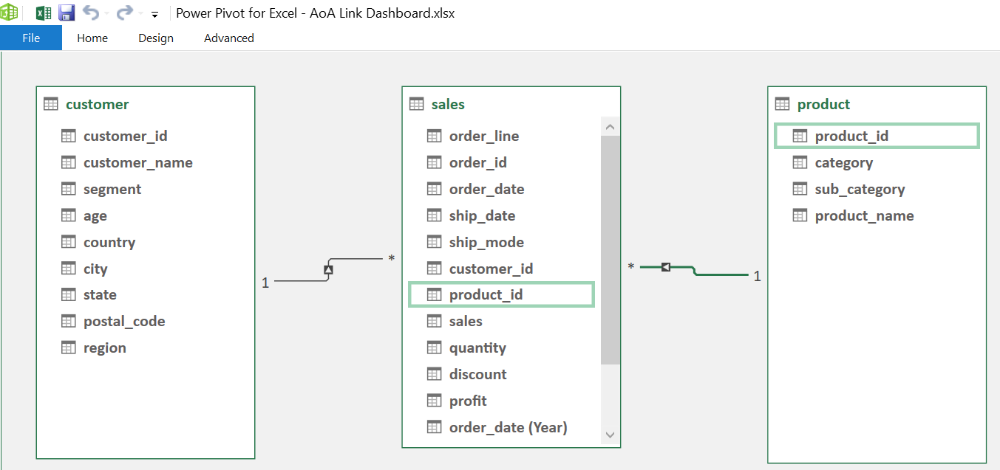
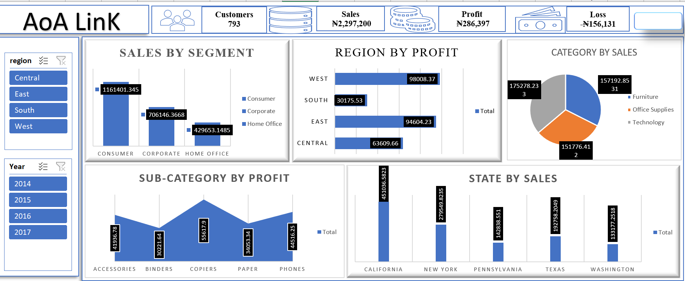

# 📊 AoA LinK Sales Performance Dashboard (Excel-Based)

An Excel-powered business intelligence dashboard analyzing sales, profit, and loss across regions, categories, and customer segments. Built with Power Pivot and interactive visuals to support strategic decision-making.

---

## 🧩 Table of Contents
1. [📘 Introduction](#-introduction)
2. [⚙️ Problem Statement](#-problem-statement)
3. [🧠 Skills Demonstrated](#-skills-demonstrated)
4. [📥 Data Sourcing](#-data-sourcing)
5. [🔄 Data Transformation](#-data-transformation)
6. [🧩 Modelling](#-modelling)
7. [📈 Analysis & Visualizations](#-analysis--visualizations)
8. [💡 Insights & Problems Solved](#-insights--problems-solved)
9. [🧾 Conclusion & Recommendations](#-conclusion--recommendations)

---

## 📘 Introduction
This Excel dashboard provides a comprehensive view of AoA LinK’s sales and profitability performance across multiple years, regions, and product categories. It enables stakeholders to monitor KPIs, identify trends, and make data-driven decisions.

---

## ⚙️ Problem Statement
The company lacked a centralized reporting system to track customer engagement, regional profitability, and product-level performance. Fragmented spreadsheets made it difficult to uncover actionable insights.

---

## 🧠 Skills Demonstrated
- Power Pivot Data Modeling  
- Excel Formulas & Calculated Columns  
- Pivot Tables & Charts  
- Slicer Integration  
- KPI Design & Conditional Formatting  
- Business Intelligence Storytelling  

---

## 📥 Data Sourcing
Data was sourced from internal Excel sheets containing:
- Customer details (region, segment, state)
- Sales transactions (order date, quantity, discount, profit)
- Product hierarchy (category, sub-category)
- Sales plan targets by year and region

---

## 🔄 Data Transformation
- Cleaned and standardized region and category names  
- Created calculated columns for profit margin and plan achievement  
- Filtered out incomplete records and duplicates  
- Added time intelligence fields (Month, Year)

---

## 🧩 Modelling

📊 Click to view data model

*Displays the Power Pivot data model linking customer, sales, and product tables for relational analysis.*

---

## 📈 Analysis & Visualizations

📊 Click to expand dashboard overview

*Highlights the Excel dashboard showcasing revenue growth, category insights, regional comparisons, and city performance ratings.*

**Key Visuals:**
- Top Bar KPIs: Customers, Sales, Profit, Loss  
- Filters: Region & Year slicers  
- Sales by Segment: Bar chart (Consumer, Corporate, Home Office)  
- Region by Profit: Bar chart (West, South, East, Central)  
- Category by Sales: Pie chart (Furniture, Office Supplies, Technology)  
- Sub-Category by Profit: Bar chart (Accessories, Binders, Copiers, etc.)  
- State by Sales: Bar chart (California, New York, Texas, etc.)

---

## 💡 Insights & Problems Solved
- West region delivered the highest profit, while Central showed consistent losses  
- Technology category nearly matched Furniture and Office Supplies in total sales  
- Copiers and Binders emerged as top profit-generating sub-categories  
- California and New York led in state-level sales performance  
- Enabled dynamic filtering by year and region for targeted analysis

---

## 🧾 Conclusion & Recommendations
The dashboard empowers AoA LinK’s leadership to:
- Focus marketing efforts on high-performing states and segments  
- Reevaluate product strategy in underperforming regions  
- Expand inventory for high-profit sub-categories  
- Monitor loss trends and optimize discount strategies

---

## 📂 Files

| File | Description |
|------|-------------|
| [`AoALink.xlsx`](./AoALink.xlsx) | Excel dashboard with Power Pivot model |
| [`AoA_Dashboard.png`](./Visuals/AoA_Dashboard.png) | Dashboard preview |
| [`AoA_Model.png`](./Visuals/AoA_Model.png) | Power Pivot data model |

---

## 💬 Author

**Uche Nelson**  
📧 [uchenelson9010@gmail.com](mailto:uchenelson9010@gmail.com)  
🔗 [LinkedIn](https://www.linkedin.com/in/uche-chukwuemeka-nelson/)  
🌐 [Portfolio](https://datascienceportfol.io/UcheNelson)

