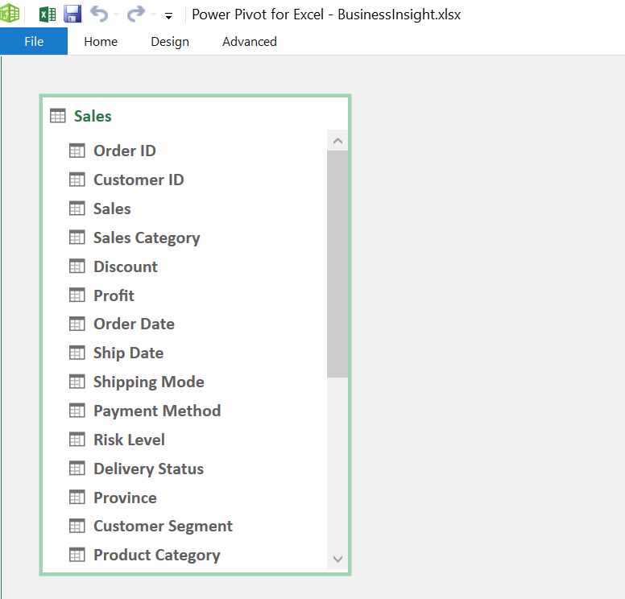
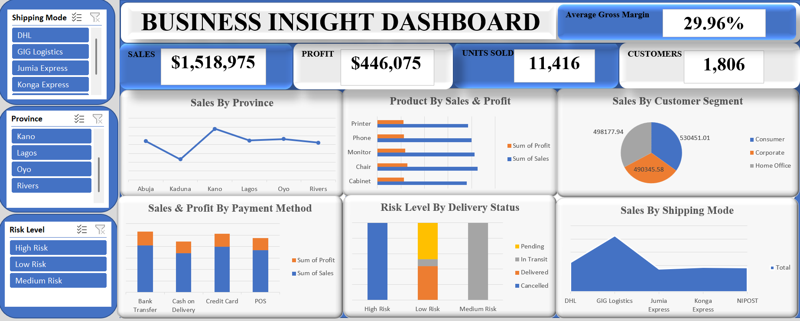

# 📊 Business Insight Dashboard (Excel-Based)

An Excel-powered dashboard that delivers deep insights into sales performance, customer segmentation, shipping logistics, and operational risk. Built with Power Pivot and interactive visuals to support strategic business decisions.

---

## 🧩 Table of Contents
1. [📘 Introduction](#-introduction)
2. [⚙️ Problem Statement](#-problem-statement)
3. [🧠 Skills Demonstrated](#-skills-demonstrated)
4. [📥 Data Sourcing](#-data-sourcing)
5. [🔄 Data Transformation](#-data-transformation)
6. [🧩 Modelling](#-modelling)
7. [📈 Analysis & Visualizations](#-analysis--visualizations)
8. [💡 Insights & Problems Solved](#-insights--problems-solved)
9. [🧾 Conclusion & Recommendations](#-conclusion--recommendations)

---

## 📘 Introduction
This Excel dashboard provides a comprehensive overview of business performance metrics, including sales, profit, customer behavior, and delivery risk. It enables stakeholders to monitor KPIs and uncover operational inefficiencies.

---

## ⚙️ Problem Statement
The business lacked a unified system to analyze customer segments, shipping modes, and payment behaviors. Decision-makers needed a tool to visualize performance and risk across multiple dimensions.

---

## 🧠 Skills Demonstrated
- Power Pivot Data Modeling  
- Excel Formulas & Calculated Columns  
- Pivot Charts & Slicers  
- KPI Design & Conditional Formatting  
- Risk Analysis & Segmentation  
- Business Intelligence Storytelling  

---

## 📥 Data Sourcing
Data was sourced from internal Excel sheets containing:
- Sales transactions (order ID, sales, profit, discount)
- Customer details (segment, province)
- Product categories
- Shipping and payment methods
- Delivery status and risk levels

---

## 🔄 Data Transformation
- Cleaned and standardized categorical fields  
- Created calculated columns for gross margin and risk flags  
- Added time intelligence fields (Order Date, Ship Date)  
- Filtered out nulls and duplicates for model integrity

---

## 🧩 Modelling

📊 Click to view data model

*Power Pivot model includes a single unified "Sales" table with fields for customer, product, shipping, and payment dimensions.*

**Key Fields:**
- Order ID, Customer ID, Sales, Profit  
- Sales Category, Discount, Risk Level  
- Delivery Status, Province, Segment  
- Product Category, Shipping Mode, Payment Method  

---

## 📈 Analysis & Visualizations

📊 Click to expand dashboard overview

  
*Excel dashboard showcasing sales performance, customer segmentation, and delivery risk.*

**Key Visuals:**
- Top KPIs: Sales ($1.5M), Profit ($446K), Units Sold (11,416), Customers (1,806)  
- Sales by Province: Line chart  
- Product by Sales & Profit: Bar chart (Interior, Furniture, Office Supplies, Technology)  
- Sales by Segment: Pie chart (Consumer, Corporate, Home Office)  
- Sales & Profit by Payment Method: Bar chart (Bank Transfer, Cash, Credit Card, POS)  
- Risk Level by Delivery Status: Bar chart (High, Medium, Low Risk)  
- Sales by Shipping Mode: Bar chart (DHL, GIG Logistics, Jumia Express, Konga Express)  

---

## 💡 Insights & Problems Solved
- **Credit Card and POS** methods yielded higher profits than cash  
- **Interior and Furniture** categories led in sales volume  
- **High-risk deliveries** were concentrated in specific provinces  
- **Consumer segment** dominated overall sales share  
- **DHL and Jumia Express** emerged as top-performing shipping modes

---

## 🧾 Conclusion & Recommendations
This dashboard enables the business to:
- Optimize shipping partnerships based on performance  
- Focus marketing on high-value customer segments  
- Improve delivery reliability in high-risk zones  
- Prioritize product categories with strong profit margins  
- Refine payment method incentives to boost profitability

---

## 📂 Files

| File | Description |
|------|-------------|
| [`BusinessInsight.xlsx`](./BusinessInsight.xlsx) | Excel dashboard with Power Pivot model |
| [`Business_Insight_Dashboard.png`](./Images/Business_Insight_Dashboard.png) | Dashboard preview |
| [`BusinessInsight_Model.png`](./Images/Business_Insight_Model.png) | Power Pivot data model screenshot |

---

## 💬 Author

**Uche Nelson**  
📧 [uchenelson9010@gmail.com](mailto:uchenelson9010@gmail.com)  
🔗 [LinkedIn](https://www.linkedin.com/in/uche-chukwuemeka-nelson/)  
🌐 [Portfolio](https://datascienceportfol.io/UcheNelson)
