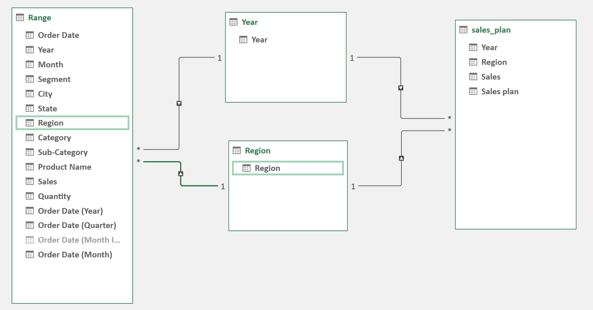
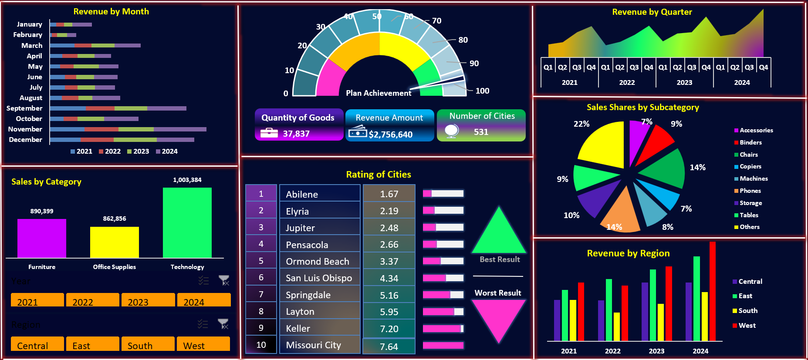

# 📊 Sales Performance Dashboard  

An interactive EXCEL dashboard that analyzes company-wide sales performance across regions, categories, and time periods — providing actionable insights to improve revenue growth and planning accuracy.  

---

## 🧩 Table of Contents  
1. [Introduction](#-introduction)  
2. [Problem Statement](#-problem-statement)  
3. [Skills Demonstrated](#-skills-demonstrated)  
4. [Data Sourcing](#-data-sourcing)  
5. [Data Transformation](#-data-transformation)  
6. [Modelling](#-modelling)  
7. [Analysis & Visualizations](#-analysis--visualizations)  
8. [Insights & Problems Solved](#-insights--problems-solved)  
9. [Conclusion & Recommendations](#-conclusion--recommendations)  
10. [Files](#-files)  

---

## 📘 Introduction  
This project focuses on evaluating sales performance trends between 2021 and 2024.  
It enables management to track revenue by month, category, and region while comparing actuals to planned targets.  

---

## ⚙️ Problem Statement  
The company lacked a unified view of its sales performance, making it difficult to:  
- Track revenue trends across time and regions  
- Compare actual performance to targets  
- Identify underperforming categories and cities  

This dashboard consolidates data into a single visual system for faster, data-driven decision-making.  

---

## 🧠 Skills Demonstrated  
- Data Modelling in EXCEL  
- Power Query (ETL)  
- DAX Calculations  
- KPI & Performance Tracking  
- Dashboard Design and Data Storytelling  

---

## 📥 Data Sourcing  
Data was sourced from internal Excel files, including:  
- **Sales Transactions:** Region, Category, Sub-Category, Product, Sales, Quantity, Date  
- **Sales Plan:** Regional targets and planned revenue by year  

---

## 🔄 Data Transformation  
- Cleaned inconsistent entries and standardized naming formats  
- Merged sales data with target data using **Region** and **Year** keys  
- Created calculated columns for **Plan Achievement** and **Revenue Growth**  

---

## 🧩 Modelling  
The model connects fact and dimension tables for better analysis and scalability.  

  
*Defines relationships between sales facts, regions, and target data.*

---

## 📈 Analysis & Visualizations  

📊 Click to expand dashboard overview

- **Revenue by Month:** Trends from 2021–2024  
- **Sales by Category:** Comparison of Furniture, Office Supplies, and Technology  
- **Revenue by Region:** Sales performance by Central, East, South, and West  
- **Sales Shares by Subcategory:** Contribution of products to total revenue  
- **Plan Achievement Gauge:** Measures progress toward annual targets  
- **Rating of Cities:** Displays top-performing and low-performing cities  

  
*Comprehensive overview of sales distribution, category performance, and KPI tracking.*

---

## 💡 Insights & Problems Solved  
- **West Region** outperformed all others in 2024, exceeding revenue targets  
- **Technology Category** showed the highest profit margin and sales growth  
- **Seasonal trends** revealed peaks in **March** and **November**  
- **Plan Achievement** reached **90%**, showing alignment with company goals  

---

## 🧾 Conclusion & Recommendations  
The dashboard delivers clear visibility into sales performance, supporting data-driven decisions.  

**Recommendations:**  
- Prioritize marketing and logistics in high-performing regions (e.g., West)  
- Increase supply of high-demand products (Technology)  
- Investigate underperforming categories (e.g., Accessories, Storage)  

---

## 📂 Files  
| File | Description |
|------|--------------|
| [`SalesPerformance.xlsx`](./SalesPerformance.xlsx) | EXCEL project file |
| [`Sales_Performance_Model.png`](./Assets/Sales_Performance_Model.png) | Data model screenshot |
| [`Sales_Performance_Dashboard.png`](./Assets/Sales_Performance_Dashboard.png) | Dashboard preview |

---

## 💬 Author  
**Uche Nelson**  
📧 [uchenelson9010@gmail.com](mailto:uchenelson9010@gmail.com)  
🔗 [LinkedIn Profile](https://www.linkedin.com/in/uche-chukwuemeka-nelson/)  
📊 [Data Science Portfolio](https://datascienceportfol.io/UcheNelson)
